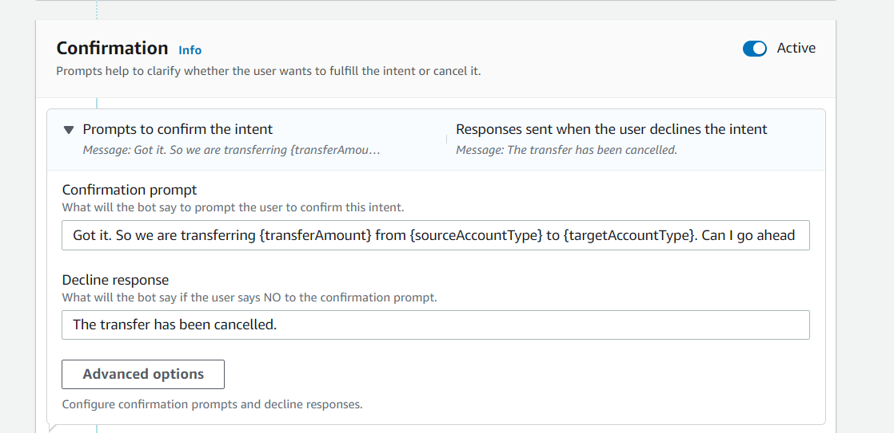
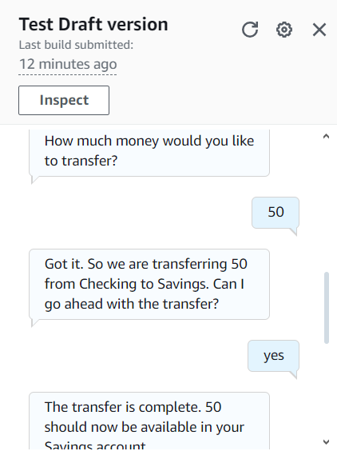
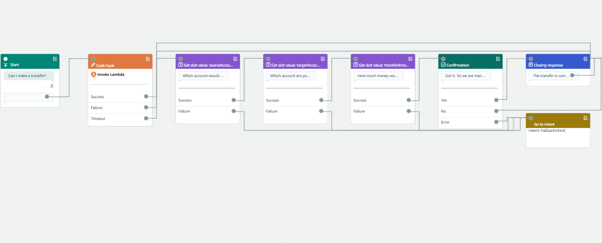

<h1>Build a Chatbot with Multiple slots</h1>

<h2>Description</h2>
 Amazon Lex is a fully managed service by AWS for building conversational interfaces into applications using voice and text. It uses automatic speech recognition (ASR) to convert speech to text and natural language understanding (NLU)
<br />

<h2>  How I used Amazon Lex in this project </h2>
 we used Amazon lex to creat a new intent that Transfer money from one account to another

<h2>Skills Demostrated:</h2>

- <b>Cloud Computing Proficiency: Configuring AWS services like IAM, Lambda, and Amazon Lex to build and manage conversational interfaces</b> 
- <b>Natural Language Understanding (NLU): Designing intents, utterances, and slot types to enable the chatbot to comprehend and respond effectively to user queries.</b>
- <b>Problem-Solving with Lambda: Developing and deploying AWS Lambda functions for custom business logic and advanced intent fulfillment..</b>

<h2>Utilities used</h2>
<ul>
  <li>AWS console</li>
   <li>Amazon Lex</li>
</ul>
<h2>Program walk-through:</h2>

<p align="center">
 TransferFunds
 An intent I created for my chatbot was TransferFunds, which will help the user transfer money between bank acount: <br/>
 
<br />
 
<br />
 Using multiple slots
 For this intent, I had to use the same slot type twice. This is because the
 TransferFunds intent involved two different account-the source account(i.e the
 account that we transferring money from)and the target account
 I also learnt how to create confirmation prompts, which are promts designed for
 the chatbot to confirm the user's intention to carry out intent.in this project,a
 confirmation prompt was used for the chatbot to confirm that the user want to
 transfer .
  <br/>

<br />

<br />
 Exploring Lex features:
 conversation flow to visualize a conversation between the bot and a user.
 You could also set up your intent using a visual builder, A visual builder allows
 you to create, modify, and test your intents through an intuitive drag-and-drop
 interface, making it easier to visualize the logic behind your bot's interactions.<br/>

<br />


</p>

<!--
 ```diff
- text in red
+ text in green
! text in orange
# text in gray
@@ text in purple (and bold)@@
```
--!>
